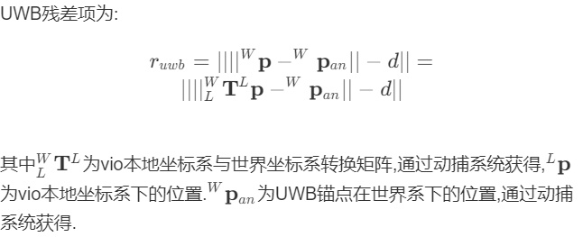

# VINS-Fusion-UWB-PHY

## Tight Fusion of Odometry and Kinematic Constraints for Multiple Aerial Vehicles in Physical Interconnection 
紧耦合物理连接下的多飞行器动力学约束里程计融合
### 配置文件与参数新增内容
agent_number:子机编号id(1到3)

USE_LOOSE:使用松耦合优化的结果

USE_UWB:使用UWB紧耦合

USE_KIN使用物理约束紧耦合

imu_delta_fre两帧图像之间使用新约束的帧数

HINGE:球铰偏置量

KIN_LENGTH:球铰之间直线距离

para_tag:UWB偏置量
### 启动程序
roslaunch vins xxx.launch(包括启动三个子机节点,数据播放bag)
eg:roslaunch vins realsense_lab1.launch

### 物理机械结构


### 算法架构


### 新加入约束

#### UWB约束残差


<!-- UWB残差项为:
$$r_{uwb}=|| ||^{W}\mathbf{p}-^{W}\mathbf{p}_{an}||-d ||
=\\|| ||^{W}_{L}\mathbf{T}^{L}\mathbf{p}-^{W}\mathbf{p}_{an}||-d ||$$
其中$^{W}_{L}\mathbf{T}^{L}$为vio本地坐标系与世界坐标系转换矩阵,通过动捕系统获得,$^{L}\mathbf{p}$为vio本地坐标系下的位置.$^{W}\mathbf{p}_{an}$为UWB锚点在世界系下的位置,通过动捕系统获得. -->
#### 物理约束残差
球铰和相机、IMU相对位置通过前期测量得到,通过vio位置姿态,可以得到球铰在vio本地坐标系和世界坐标系中的表示:


球铰之间的欧几里得距离为定值,以此写出位置残差


三个球铰的位置和速度可以计算其平面刚体的角速度

中心平台IMU提供测量角速度,由此写出速度残差


三个球铰位置可以计算其平面刚体姿态与重力平面夹角,以此写出姿态残差


### 实验运动轨迹


### 实验结果
#### SIAP与LIAP误差四分位图


#### 实验序列结果对比


## VINS-Fusion An optimization-based multi-sensor state estimator

**Features:**
- multiple sensors support (stereo cameras / mono camera+IMU / stereo cameras+IMU)
- online spatial calibration (transformation between camera and IMU)
- online temporal calibration (time offset between camera and IMU)
- visual loop closure


## 1. Prerequisites
### 1.1 **Ubuntu** and **ROS**
Ubuntu 64-bit 16.04 or 18.04.
ROS Kinetic or Melodic. [ROS Installation](http://wiki.ros.org/ROS/Installation)


### 1.2. **Ceres Solver**
Follow [Ceres Installation](http://ceres-solver.org/installation.html).

## 2. EuRoC Example
Download [EuRoC MAV Dataset](http://projects.asl.ethz.ch/datasets/doku.php?id=kmavvisualinertialdatasets) to YOUR_DATASET_FOLDER. Take MH_01 for example, you can run VINS-Fusion with three sensor types (monocular camera + IMU, stereo cameras + IMU and stereo cameras). 
Open four terminals, run vins odometry, visual loop closure(optional), rviz and play the bag file respectively. 
Green path is VIO odometry; red path is odometry under visual loop closure.

### 2.1 Monocualr camera + IMU

```
    roslaunch vins vins_rviz.launch
    rosrun vins vins_node ~/catkin_ws/src/VINS-Fusion/config/euroc/euroc_mono_imu_config.yaml 
    (optional) rosrun loop_fusion loop_fusion_node ~/catkin_ws/src/VINS-Fusion/config/euroc/euroc_mono_imu_config.yaml 
    rosbag play YOUR_DATASET_FOLDER/MH_01_easy.bag
```

### 2.2 Stereo cameras + IMU

```
    roslaunch vins vins_rviz.launch
    rosrun vins vins_node ~/catkin_ws/src/VINS-Fusion/config/euroc/euroc_stereo_imu_config.yaml 
    (optional) rosrun loop_fusion loop_fusion_node ~/catkin_ws/src/VINS-Fusion/config/euroc/euroc_stereo_imu_config.yaml 
    rosbag play YOUR_DATASET_FOLDER/MH_01_easy.bag
```

### 2.3 Stereo cameras

```
    roslaunch vins vins_rviz.launch
    rosrun vins vins_node ~/catkin_ws/src/VINS-Fusion/config/euroc/euroc_stereo_config.yaml 
    (optional) rosrun loop_fusion loop_fusion_node ~/catkin_ws/src/VINS-Fusion/config/euroc/euroc_stereo_config.yaml 
    rosbag play YOUR_DATASET_FOLDER/MH_01_easy.bag
```


## 3. KITTI Example
### 3.1 KITTI Odometry (Stereo)
Download [KITTI Odometry dataset](http://www.cvlibs.net/datasets/kitti/eval_odometry.php) to YOUR_DATASET_FOLDER. Take sequences 00 for example,
Open two terminals, run vins and rviz respectively. 
(We evaluated odometry on KITTI benchmark without loop closure funtion)
```
    roslaunch vins vins_rviz.launch
    (optional) rosrun loop_fusion loop_fusion_node ~/catkin_ws/src/VINS-Fusion/config/kitti_odom/kitti_config00-02.yaml
    rosrun vins kitti_odom_test ~/catkin_ws/src/VINS-Fusion/config/kitti_odom/kitti_config00-02.yaml YOUR_DATASET_FOLDER/sequences/00/ 
```
### 3.2 KITTI GPS Fusion (Stereo + GPS)
Download [KITTI raw dataset](http://www.cvlibs.net/datasets/kitti/raw_data.php) to YOUR_DATASET_FOLDER. Take [2011_10_03_drive_0027_synced](https://s3.eu-central-1.amazonaws.com/avg-kitti/raw_data/2011_10_03_drive_0027/2011_10_03_drive_0027_sync.zip) for example.
Open three terminals, run vins, global fusion and rviz respectively. 
Green path is VIO odometry; blue path is odometry under GPS global fusion.
```
    roslaunch vins vins_rviz.launch
    rosrun vins kitti_gps_test ~/catkin_ws/src/VINS-Fusion/config/kitti_raw/kitti_10_03_config.yaml YOUR_DATASET_FOLDER/2011_10_03_drive_0027_sync/ 
    rosrun global_fusion global_fusion_node
```

## 4. Run with your devices 
VIO is not only a software algorithm, it heavily relies on hardware quality. For beginners, we recommend you to run VIO with professional equipment, which contains global shutter cameras and hardware synchronization.

### 4.1 Configuration file
Write a config file for your device. You can take config files of EuRoC and KITTI as the example. 

### 4.2 Camera calibration
VINS-Fusion support several camera models (pinhole, mei, equidistant). You can use [camera model](https://github.com/hengli/camodocal) to calibrate your cameras. We put some example data under /camera_models/calibrationdata to tell you how to calibrate.
```
cd ~/catkin_ws/src/VINS-Fusion/camera_models/camera_calib_example/
rosrun camera_models Calibrations -w 12 -h 8 -s 80 -i calibrationdata --camera-model pinhole
```

